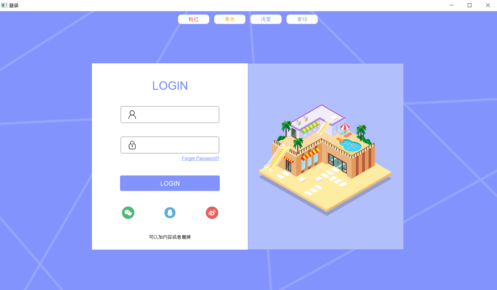
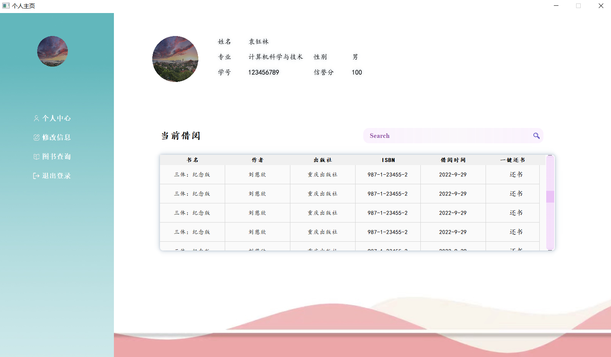

# 前端界面说明

## 10.6更新

注明：10.8或者10.9会有readme更新，10.6更新为前后端整合后第一版代码，只实现登录，登录账号密码均为123.

代码结构有较大改动，建议提前下载看看。

#### 1.文件介绍

目前前端文件分为以下几个文件（cpp，h，ui）

1**.widget**,主login界面

2.**mainwindow**，login后的主界面

3.**mainwidget**，继承了QStackedWidget,有ui文件，但是不会展示界面，用于控制我们功能界面的叠放次序。

4.**UserProfileWidget**，个人信息界面

5.**QueryBookWidget**,图书查询界面

6.**SearchLineEdit**,自己写的一个搜索框类，目前只支持改变大小等操作，后续会有改变样式。

7.**StdItemModel**，不用管，为实现个人信息界面借阅列表文本居中重写其中QStandardItemModel的data方法写的一个**c++类**

8.**main**，梦开始的地方。


#### 2.需要后端提供数据的文件

1.**mainwindow**，前端信号槽我给你写好了,你需要做的事把登录的信息在数据库查询后，把返回数据给左边菜单栏的label。

这里代码写在构造函数里面即可，或者新增函数loadData。

2.**widget**，登录界面，需要传送登录信息,

```c++
void Widget::on_btn_login_clicked()
{

    //需要连接后端
     this->hide();
    MainWindow *personal_homepage = new MainWindow;
     personal_homepage->show();
}
```

在这里修改哦

3.**UserProfileWidget**，需要后端提供个人信息以及查询个人借阅信息（show_borrow函数）等。

以下是show_borrow函数前端的测试代码，后端拿到数据更改即可。

```c++
//往表格中添加数据 连接后端把下面加入for循环
    int n=50;//借阅书数量
    for(int i=0;i<30;i++){
        model->setItem(i, 0, new QStandardItem("三体：纪念版"));
        model->setItem(i, 1, new QStandardItem("刘慈欣"));
        model->setItem(i, 2, new QStandardItem("重庆出版社"));
        model->setItem(i, 3, new QStandardItem("987-1-23455-2"));
        model->setItem(i, 4, new QStandardItem("2022-9-29"));
        ui->tbv_borrow->setRowHeight(i,50);
        //往表格中添加按钮控件
        QPushButton *button = new QPushButton("还书");

         //QPushButton *button1 = new QPushButton("还书");
        //设置按钮的自定义属性
        button->setProperty("tb_ISBN",model->index(i,3,QModelIndex()).data().toString());
    //    button->setProperty("S_Password",model->index(0,1,QModelIndex()).data().toInt());//还可以定义返回其他列
        //为按钮点击信号绑定响应槽函数
        connect(button, SIGNAL(clicked(bool)), this, SLOT(onTableBtnClicked()));
       // connect(button1, SIGNAL(clicked(bool)), this, SLOT(onTableBtnClicked()));
        //将按钮加入表格中
        ui->tbv_borrow->setIndexWidget(model->index(i,5),button);
        //ui->tbv_borrow->setIndexWidget(model->index(model->rowCount()-1,5),button);//rowCount()-1是最后行号，从0行开始
    }
```

当然，那个搜索按钮应该也有对应的功能，不过要等图书查询的detail界面完成后，可以考虑添加代码。

其他暂时还没有完工，写完了继续补充。


#### 3.前端目前界面实现效果

##### 1.登录



可以切换四种皮肤

##### 2.个人信息

点击login进入（因为无后端逻辑，不用密码）



目前正在做图书查询界面，个人中心和图书查询的信号槽已经写好了，可以跳转方便调试。

打算新增：图书查询（查看一些榜单，推荐等界面，可以查询图书），BookQuery，图书列表（按照关键字或者分类查询的图书列表），BookList；图书详情（点击一本图书进入的详情界面），BookDetail